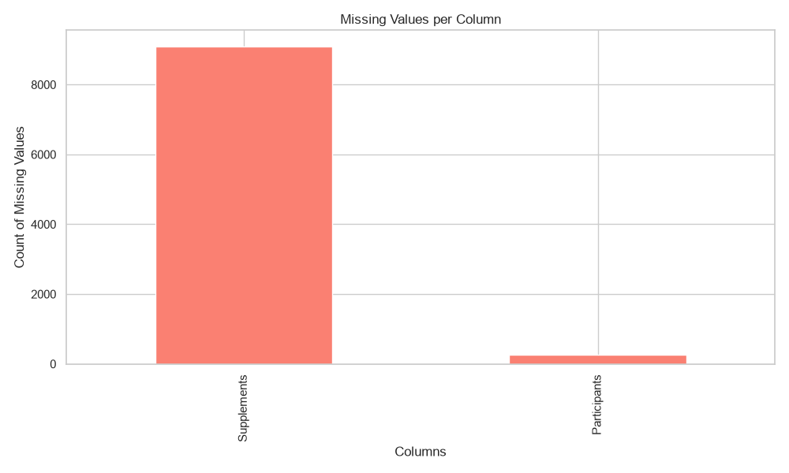
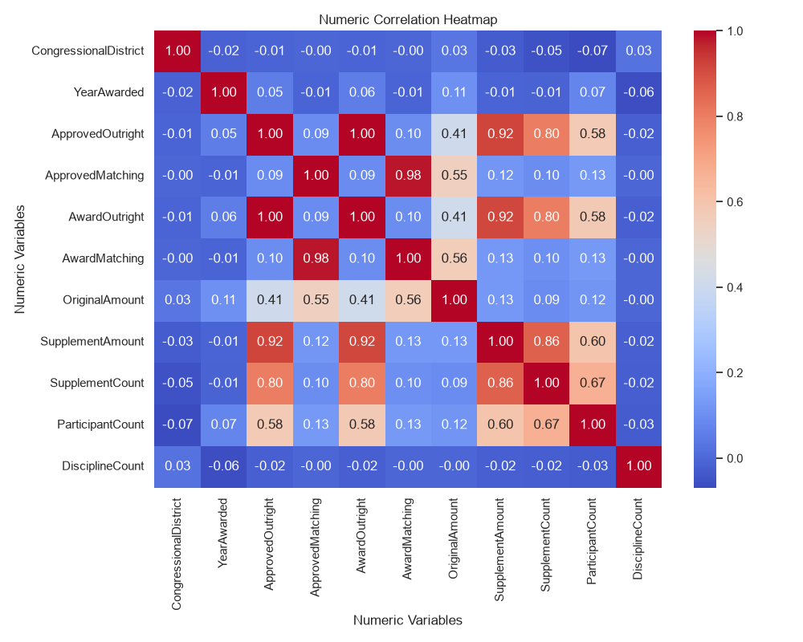
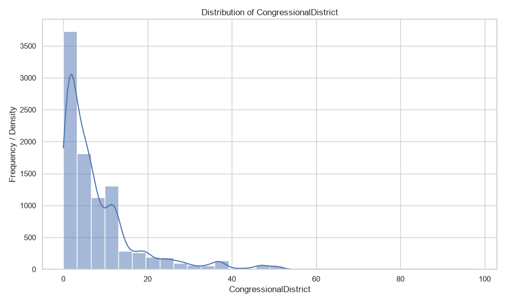
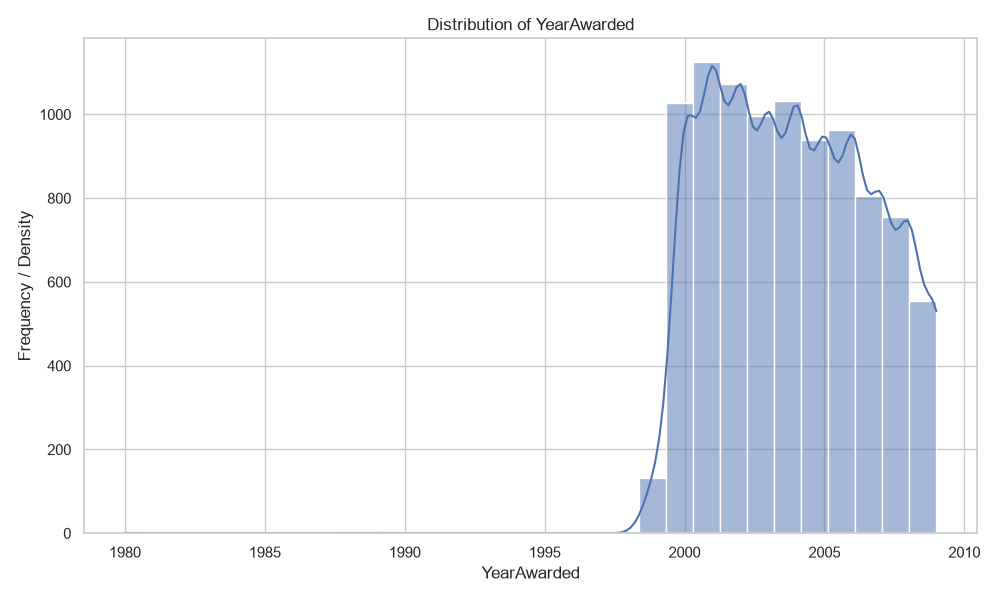
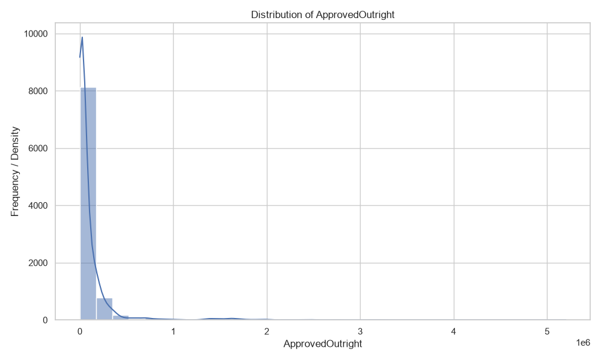
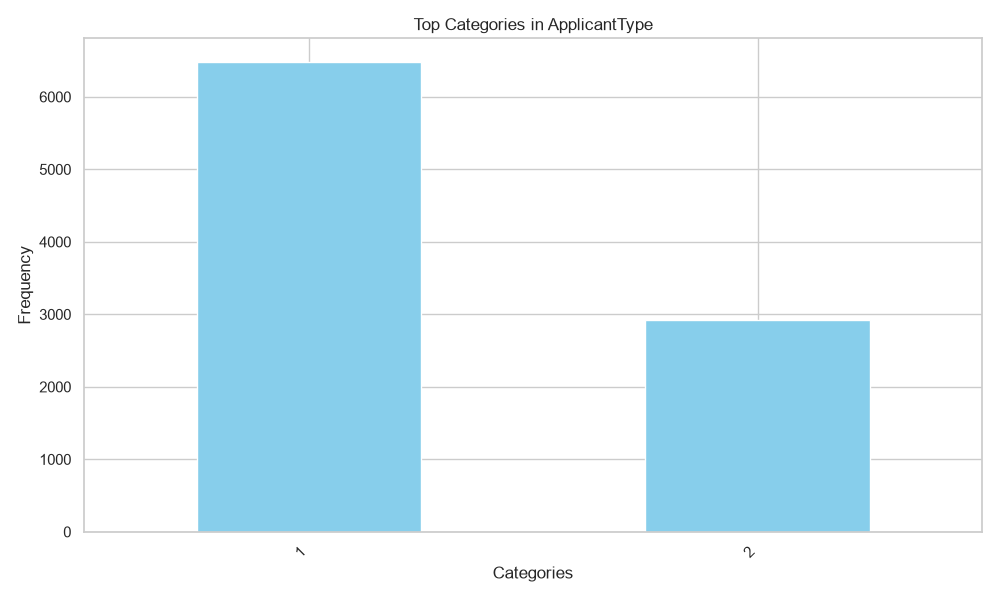
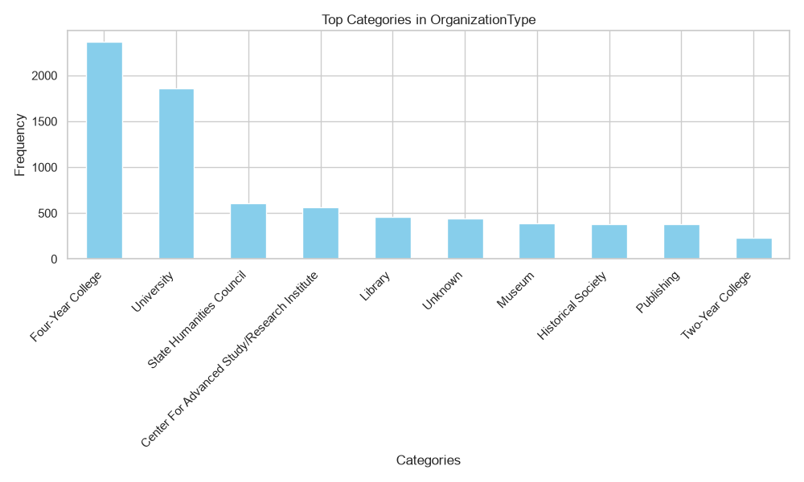
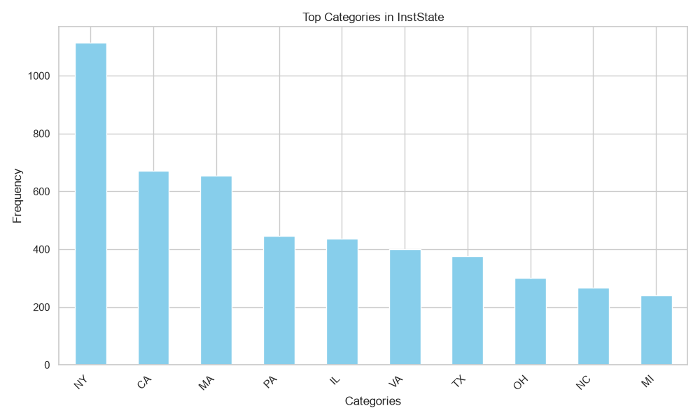
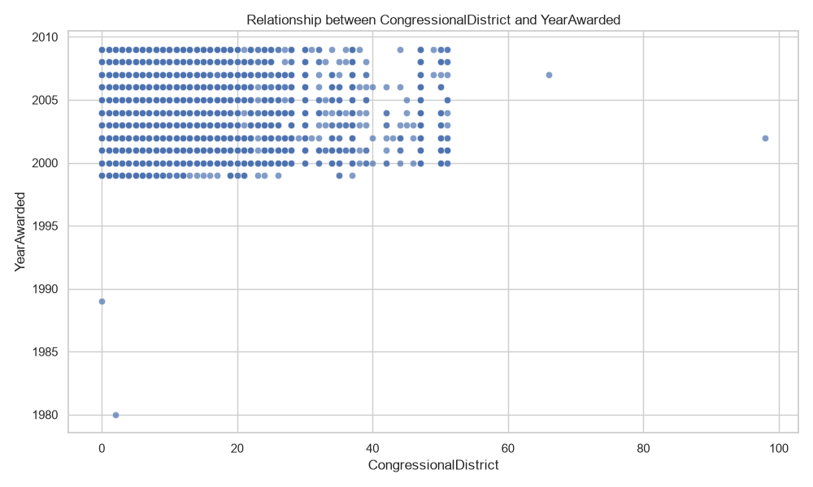

# Data Profiling & Evidence Report: NEH_Grants2000s.csv

## 1. Dataset Overview
- **Filename:** `NEH_Grants2000s.csv`
- **Total Rows:** 9402
- **Total Columns:** 33

## 2. AI-Assisted Evidence-Based Insights
The analysis yields the following results:

1. **Overall Rating**: The overall rating is 0.9988, indicating that the most significant aspect of the survey data is its overall quality and credibility.

2. **Positive Pair**: The strongest positive pair is `ApprovedOutright` and `AwardOutright`, both with a score of 0.9988.

3. **Positive Value**: The highest value among the positive pair is `ApprovedOutright` with a score of 0.9988.

4. **Negative Pair**: The strongest negative pair is `CongressionalDistrict` and `ParticipantCount`, with a score of -0.0688.

5. **Negative Value**: The lowest negative value is `CongressionalDistrict`, with a score of -0.0688.

6. **Skipped**: The final output does not include any additional statistics or details beyond the positive and negative pairs identified in the analysis.

## 3. Data Quality Overview
- **Number of duplicate rows in each columns:** Handled across 33 columns
- **Columns containing only one distinct value:** None detected
- **Columns with a high percentage of missing values:** Supplements
- **Columns that have mixed or inconsistent data type:** None detected
- **Columns that have identifier-like or extremely high-cardinality data type:** AppNumber, Supplements
- **Columns that might contain sensitive data based on column name:** None detected

## 4. Visualizations

