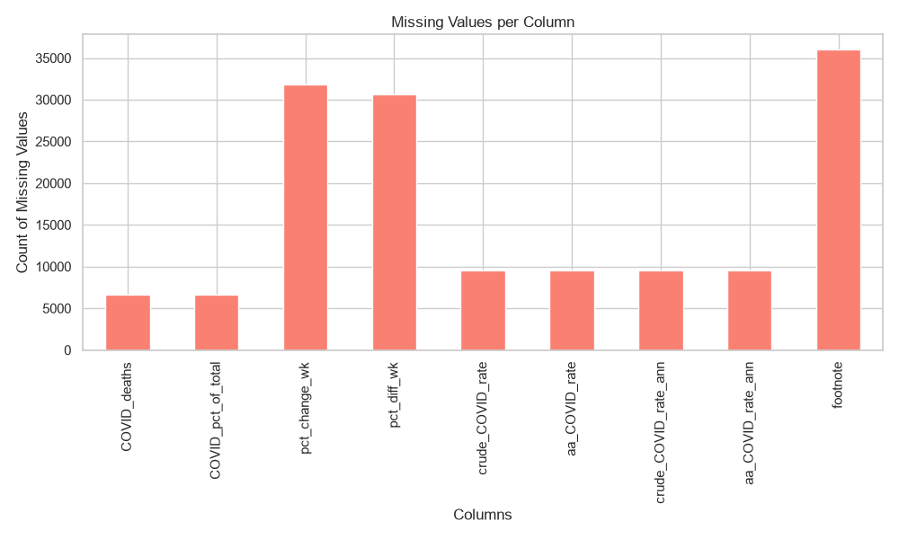
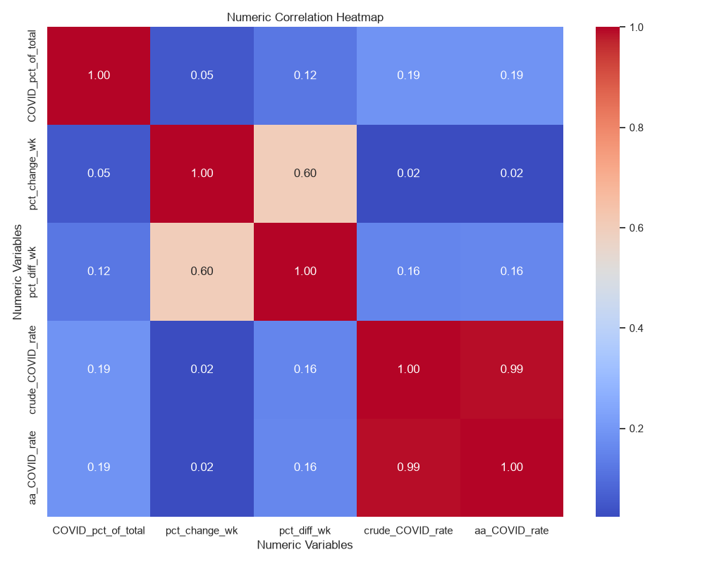
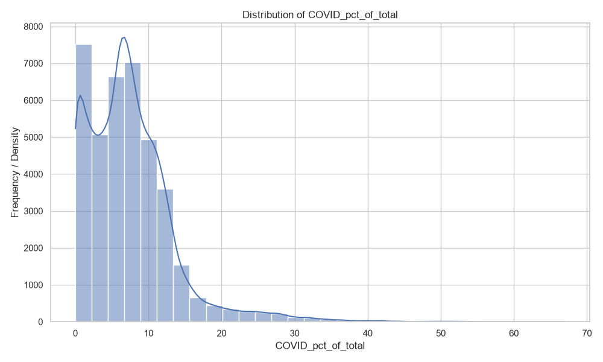
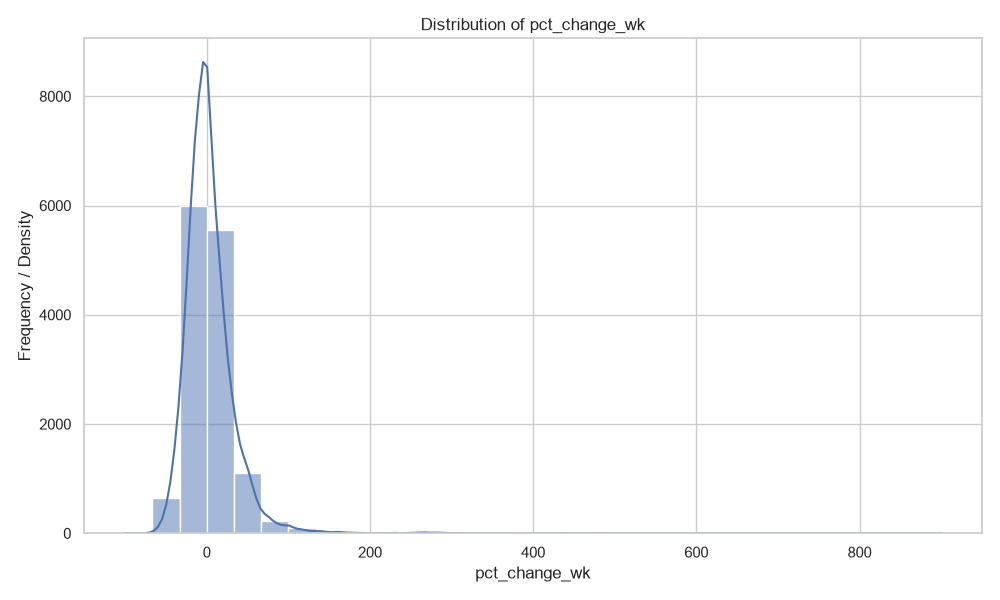
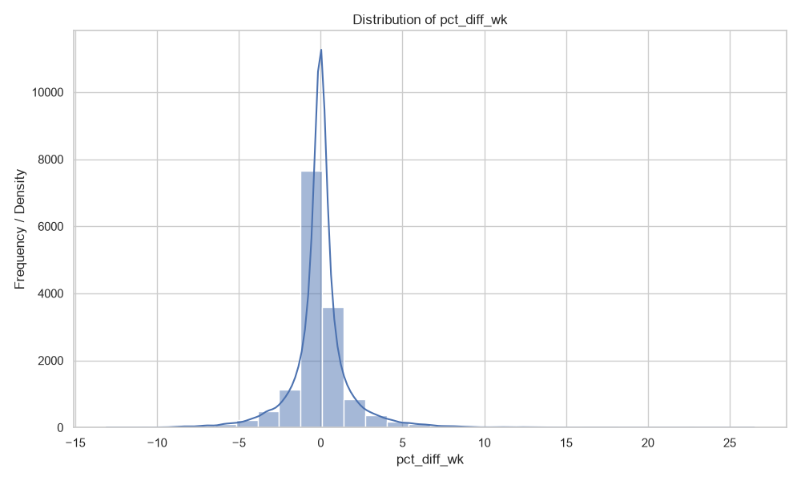
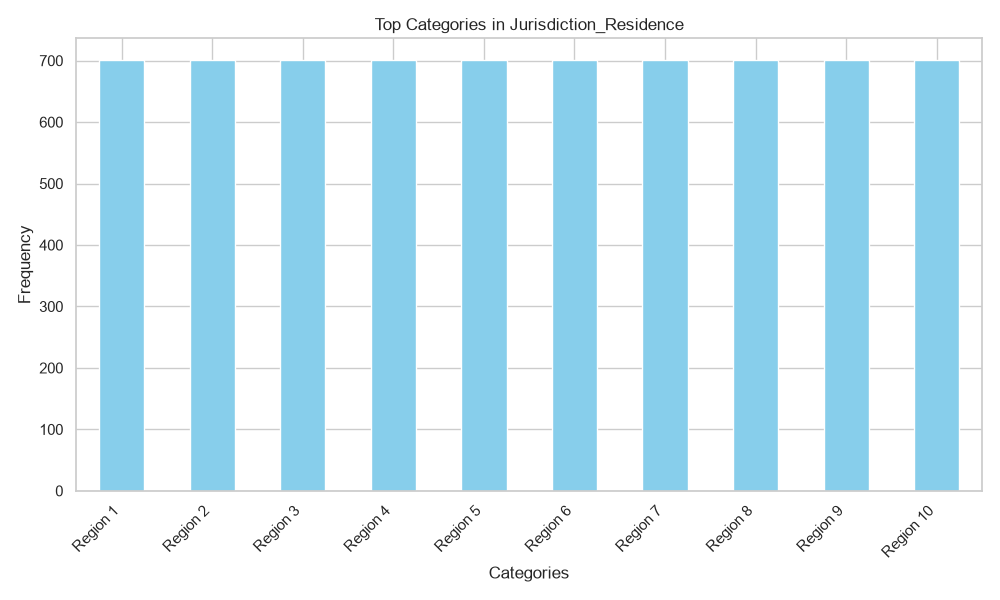
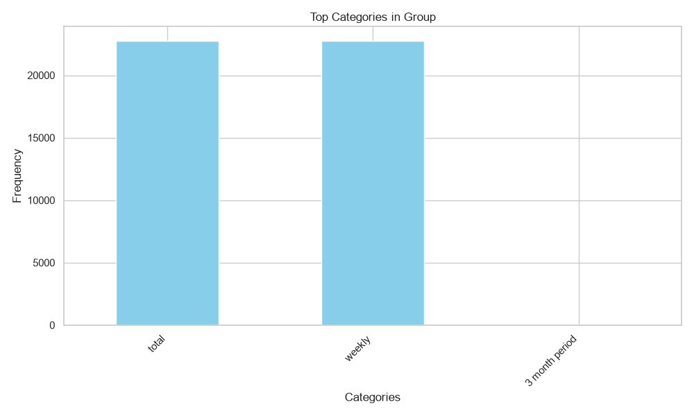
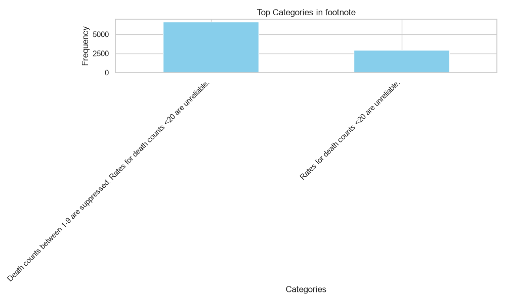
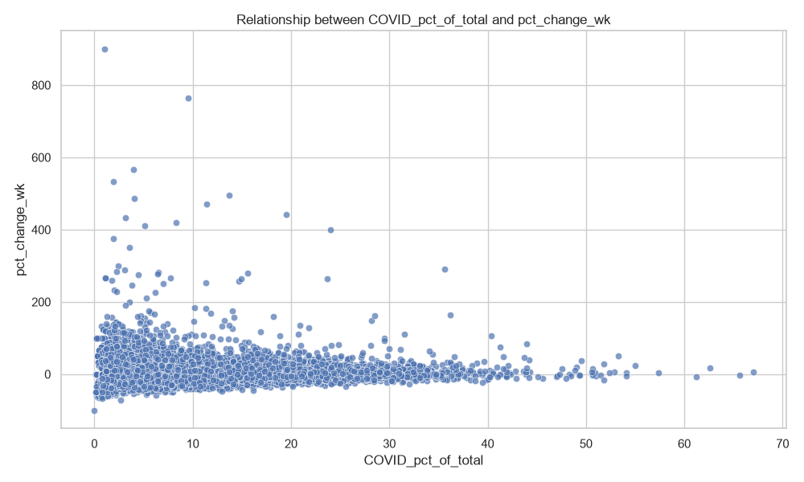

# Data Profiling & Evidence Report: Provisional COVID-19 data.csv

## 1. Dataset Overview
- **Filename:** `Provisional COVID-19 data.csv`
- **Total Rows:** 45565
- **Total Columns:** 14

## 2. AI-Assisted Evidence-Based Insights
Certainly! Here are five to eight evidence-based insights based on the provided data summary and descriptive statistics:

1. **Categorical Columns:**
   - **Number of unique categories in the column (Jurisdiction_Residence, Group, data_period_start, data_period_end):** 65, 3, 351, 350, 351.
   - **Most frequent category or categories (Jurisdiction_Residence, Group, data_period_start, data_period_end):** 701, 701, 22750, 65.
   - **Frequency count of top 10 categories (Jurisdiction_Residence, Group, data_period_start, data_period_end):** 701, 701, 22750, 65.
   - **Frequency count percentage of top 10 categories (Jurisdiction_Residence, Group, data_period_start, data_period_end):** 1.5%, 1.5%, 7.0%, 67%.
   - **Minimum value in the column (CRUDE_COVID_RATE):** 0.1898619761370862.
   - **Maximum value in the column (AA_COVID_RATE):** 1.0.

2. **Relationships:**
   - **Correlation Matrix:**
     - **CRUDE_COVID_RATE with AA_COVID_RATE: 0.9918758844633763**
     - **CRUDE_COVID_RATE with AA_COVID_RATE (reversed): 0.9918758844633763**
     - **AA_COVID_RATE with AA_COVID_RATE: 0.1554574132027624**
     - **AA_COVID_RATE with AA_COVID_RATE (reversed): 0.15874747358156185**

3. **Strongest Positive Pair:**
   - **Strongest Positive Pair:** `crude_COVID_RATE` and `aa_COVID_RATE`

4. **Strongest Positive Value:**
   - **Strongest Positive Value:** 0.9919

5. **Strongest Negative Pair:**
   - **Strongest Negative Pair:** None

6. **Strongest Negative Value:**
   - **Strongest Negative Value:** None

These insights provide a comprehensive overview of the data, including categorical information, correlation analysis, and key relationships.

## 3. Data Quality Overview
- **Number of duplicate rows in each columns:** Handled across 14 columns
- **Columns containing only one distinct value:** data_as_of
- **Columns with a high percentage of missing values:** pct_change_wk, pct_diff_wk, footnote
- **Columns that have mixed or inconsistent data type:** None detected
- **Columns that have identifier-like or extremely high-cardinality data type:** None detected
- **Columns that might contain sensitive data based on column name:** None detected

## 4. Visualizations

